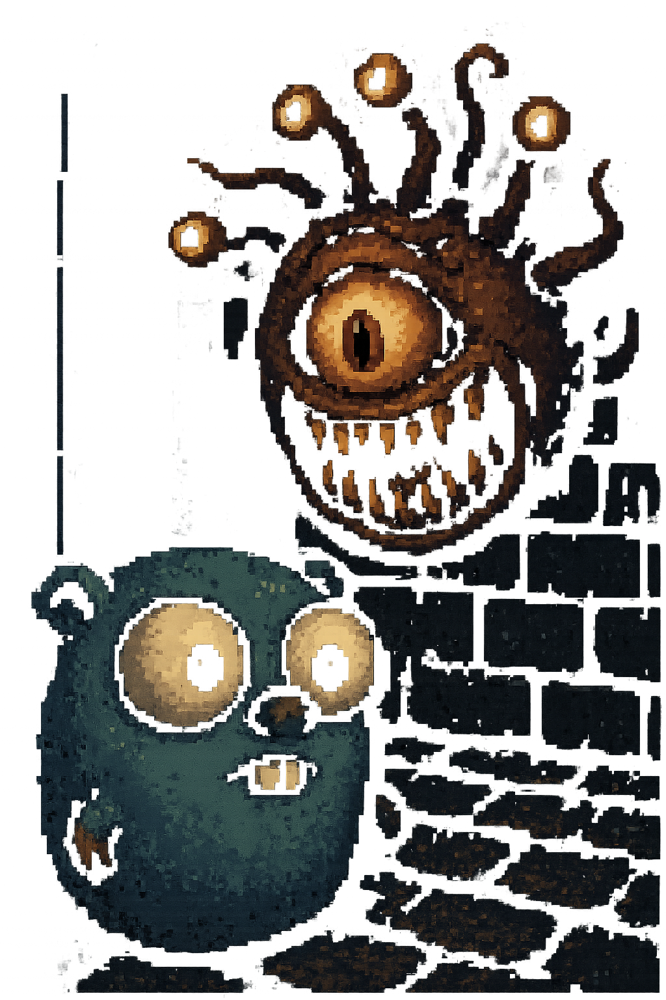

# Introduction

An attempt to implement the engine of the DOS game [Eye of the
beholder](https://wiki.scummvm.org/index.php/Eye_of_the_Beholder) in
golang. 

It's not meant to a production quality thing. Just a toy for me to
learn Golang

